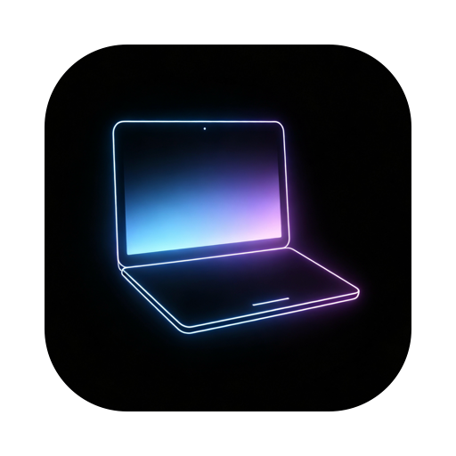

# Display Master

A tiny macOS menu bar app that controls your displays: **turn individual displays on/off, set brightness, toggle HiDPI, and switch resolutions** — all from one menu, no Dock icon.

<p align="center">
  
</p>

<p align="center">
  <a href="https://github.com/906351854/DisplayMaster/releases/latest"><b>Download</b></a>
  &nbsp;·&nbsp;
  <a href="https://906351854.github.io/DisplayMaster/"><b>Website &amp; docs</b></a>
  &nbsp;·&nbsp;
  <a href="README.zh-CN.md">中文说明</a>
</p>

---

## Why

macOS gives you one "Displays" pane for everything. It can't power down a single monitor, can't reach a monitor's brightness over DDC, and buries HiDPI modes inside a long resolution list. Display Master puts all of that two clicks away in the menu bar.

It was written as a free replacement for BetterDisplay's Pro-only *display connection* feature, then grew into a general-purpose display controller.

## Features

| Feature | Notes |
|---|---|
| **Per-display on/off** | Actually removes the display from the layout (windows reflow onto the remaining screens). Closed displays stay listed at the bottom of the menu so you can bring them back. |
| **Auto-off built-in when docked** | A top-level toggle. Plug in an external monitor and the built-in panel turns off; unplug it and the built-in comes back. It only acts at those two moments, so it won't fight you when you turn the built-in back on yourself. |
| **Brightness** | The slider sits **directly in the top-level menu** under each display — no submenu to open. Built-in panels go through `DisplayServices`; external monitors go through DDC/CI over I²C. |
| **HiDPI toggle** | Flips the render scale at the same logical resolution (`2560×1440 HiDPI ⇄ 2560×1440`). If the panel has no same-size counterpart (typical for built-in Retina displays), it falls back to the nearest resolution and says so in the menu title. |
| **Resolution switching** | A curated list of common modes (HiDPI variants marked), plus a *Show all resolutions* toggle for the full list an EDID may expose. |
| **DDC diagnostics** | `--ddc-test` / `--ddc-storm` exercise the DDC channel end-to-end; the menu shows a plain-language reason when brightness can't be controlled. |

Everything is plain Swift + AppKit. No third-party dependencies, no kernel extension, no entitlements, no network access.

## Requirements

- macOS 14 or later
- Apple Silicon or Intel — released as a universal binary
- Built and verified on macOS 26.6 (Tahoe), Apple Silicon

> **On Intel Macs, external-monitor brightness is unavailable.** The DDC path goes through the
> `IOAVService` private framework, which only exists on Apple Silicon; Intel needs `IOI2CInterface`
> instead, which this project does not implement. Everything else — display on/off, resolutions,
> HiDPI, built-in brightness — works. The Intel path has not been tested on real hardware;
> please open an issue if you run into problems.

## Download

Grab the latest from [Releases](https://github.com/906351854/DisplayMaster/releases/latest):

- **`DisplayMaster-<version>.dmg`** (recommended) — mount it, drag `Display Master.app` from the left onto "Applications" on the right, then eject.
- **`DisplayMaster-<version>.zip`** — if you'd rather not mount a disk image. Use the built-in Archive Utility to unzip; some third-party tools drop metadata and break the code signature.

Gatekeeper blocks the first launch (the app is not signed with an Apple Developer ID): right-click the app → **Open** → **Open** again. Full steps, including a command-line route, are in the [install guide](https://906351854.github.io/DisplayMaster/install.html).

## Build & install

```bash
git clone https://github.com/906351854/DisplayMaster.git
cd DisplayMaster
./build.sh
```

`build.sh` compiles a universal release binary (arm64 + x86_64), assembles the `.app` bundle, ad-hoc signs it, installs it to `/Applications`, and restarts the running instance.

- `--no-install` — build into `build/` only, leave `/Applications` alone
- `--native` — compile only the host architecture (much faster while iterating)
- `--dmg` — also produce `build/DisplayMaster-<version>.dmg` (combinable with the above).
  The DMG window layout is written by `Tools/make-dsstore.py`, which needs `pip install ds_store mac_alias`;
  without them the script falls back to driving Finder via AppleScript, and failing that still emits a
  fully working DMG with default window styling.

The app lives in the menu bar only — there is no Dock icon and no window.

### Icons

`Resources/AppIcon.icns` and the menu bar glyphs are committed, so a build works out of the box. To regenerate them from `Resources/Logo.jpg`:

```bash
swift Tools/make-icons.swift .
```

That produces a squircle-masked app icon (full `.iconset`) plus 18/36/54 px single-colour menu bar glyphs. Replace `Resources/Logo.jpg` with your own square artwork and re-run.

## Repository layout

```
Sources/DisplayMaster/
  main.swift           Entry point + command-line diagnostics (--selftest / --ddc-test / --hidpi-test / --dump-menu)
  AppDelegate.swift    Menu bar item and menu construction
  DisplayManager.swift Display enumeration, on/off, resolutions, HiDPI detection, brightness throttling
  DDC.swift            External-monitor DDC/CI channel (IOAVService): timing, retries, cooldown
  PrivateAPI.swift     Runtime loading of private symbols
  AppInfo.swift        Name / version / repo URL (build.sh reads the version from here)
Tools/
  make-icons.swift     Generates the app icon and menu bar glyphs from Resources/Logo.jpg
  make-dmg.sh          Packages the .app into a DMG (drag-to-install layout, background, volume icon)
  make-dmg-background.swift  Renders the DMG window background
  make-dsstore.py      Writes .DS_Store directly to set window size / icon positions / background (no Finder permission needed)
  probe/               Standalone probes for the private APIs, to check they still exist on a given machine
Resources/             Logo, generated .icns and menu bar glyphs
docs/                  Website and docs (GitHub Pages serves this directory)
DEPLOY.md              Hosting guide: switching platforms, custom domains, troubleshooting
```

## Command line

The binary doubles as a diagnostic tool. Handy because the GUI can't be scripted:

```bash
APP="/Applications/Display Master.app/Contents/MacOS/DisplayMaster"

"$APP" --selftest                    # private API availability, displays, modes, brightness
"$APP" --dump-menu                   # print the whole menu tree without opening it
"$APP" --hidpi-test                  # report what a HiDPI toggle would do (read-only)
"$APP" --hidpi-test --apply --all    # actually toggle every display, then restore
"$APP" --ddc-test                    # read → write → re-read → restore, proves DDC writes work
"$APP" --ddc-storm                   # simulate slider dragging: 100 rapid calls, checks throttling
"$APP" --toggle-test                 # turn a display off, turn it back on, checks the "disabled" record is cleared
"$APP" --ddc-recover-test            # fake a dead DDC channel, prove the self-healing path revives it
"$APP" --wake-test                   # sleep the display, wake it, check the channel still works
"$APP" --auto-test                   # report what the auto-off rule would decide (add --apply to run it)
"$APP" --auto-scenarios              # run the decision logic against constructed scenarios, touches no hardware
"$APP" --shot-menu /tmp/m.png         # pop the real menu and screenshot it (add --page2 <id> for the detail page)
"$APP" --hits                        # print the on-screen center of every clickable row, keep the menu open
```

## How it works

Three private-API paths, all loaded at runtime with `dlopen`/`dlsym` so nothing private is linked at build time:

| Capability | API | Framework |
|---|---|---|
| Enable/disable a display | `CGSConfigureDisplayEnabled` wrapped in a `CGBeginDisplayConfiguration` → `CGCompleteDisplayConfiguration` transaction | `SkyLight` |
| Built-in brightness | `DisplayServicesGetBrightness` / `SetBrightness` / `CanChangeBrightness` | `DisplayServices` |
| External brightness | `IOAVServiceCreateWithService` + `WriteI2C` / `ReadI2C`, DDC/CI VCP `0x10` | `IOKit` |
| Full mode list | `CGDisplayCopyAllDisplayModes` with `kCGDisplayShowDuplicateLowResolutionModes` | `CoreGraphics` |

Two things worth knowing if you touch this code:

1. **`CGSConfigureDisplayEnabled` takes a `CGDisplayConfigRef`, not a connection ID.** Passing `CGSMainConnectionID()` there segfaults inside `SLSConfigureDisplayEnabled`. It must be used inside the public configuration transaction.
2. **`CGDisplayCopyAllDisplayModes` without `kCGDisplayShowDuplicateLowResolutionModes` hides HiDPI modes.** On a built-in Retina display you get three legacy scaled modes and not even the mode that is currently active.

## Caveats

- **Private API, not App Store distributable.** Apple can change or remove these symbols in any release. `--selftest` tells you whether they still resolve.
- **Ad-hoc signed.** `spctl -a -vv` reports `rejected` — that's expected for a self-built app without a Developer ID. It runs fine because a locally built copy has no quarantine attribute. Gatekeeper will complain if you move the `.app` to another Mac; right-click → Open, or `xattr -cr`.
- **Disabling a display is session-scoped.** It does not survive a display sleep or a reboot — everything comes back. That's a safety net, not a bug. The app remembers which displays you closed (in `UserDefaults`) so the menu can offer to reopen them.
- **DDC can get stuck.** A chattering DDC channel makes some monitors stop answering until they are power-cycled. The app throttles writes (100 ms) and reads (2 s) for exactly this reason; if brightness stops responding, power-cycle the monitor from the wall, or toggle the display off/on once (`CGSConfigureDisplayEnabled`) which re-trains the link.
- **One external display mapping is positional.** With a single external monitor the DDC service index maps 1:1 by display ID. With two or more external monitors of the same model, pairing should be done by EDID; that's not implemented yet.
- **External-monitor brightness needs Apple Silicon.** The DDC path goes through the `IOAVService` private framework, which only exists on Apple Silicon. Intel Macs need `IOI2CInterface` instead, which is not implemented — so the brightness slider reports "not controllable" for external monitors there. Everything else (on/off, resolutions, HiDPI, built-in brightness) works, but the Intel path has not been tested on real hardware.

## Related

- [BetterDisplay](https://github.com/waydabber/BetterDisplay) — far more capable, and where the Pro/paid line is drawn at display connections
- [MonitorControl](https://github.com/MonitorControl/MonitorControl) — the DDC timing in `DDC.swift` follows its `Arm64DDC` implementation
- [ddcctl](https://github.com/kfix/ddcctl) — useful reference for DDC/CI packet formats

## License

MIT — see [LICENSE](LICENSE).
